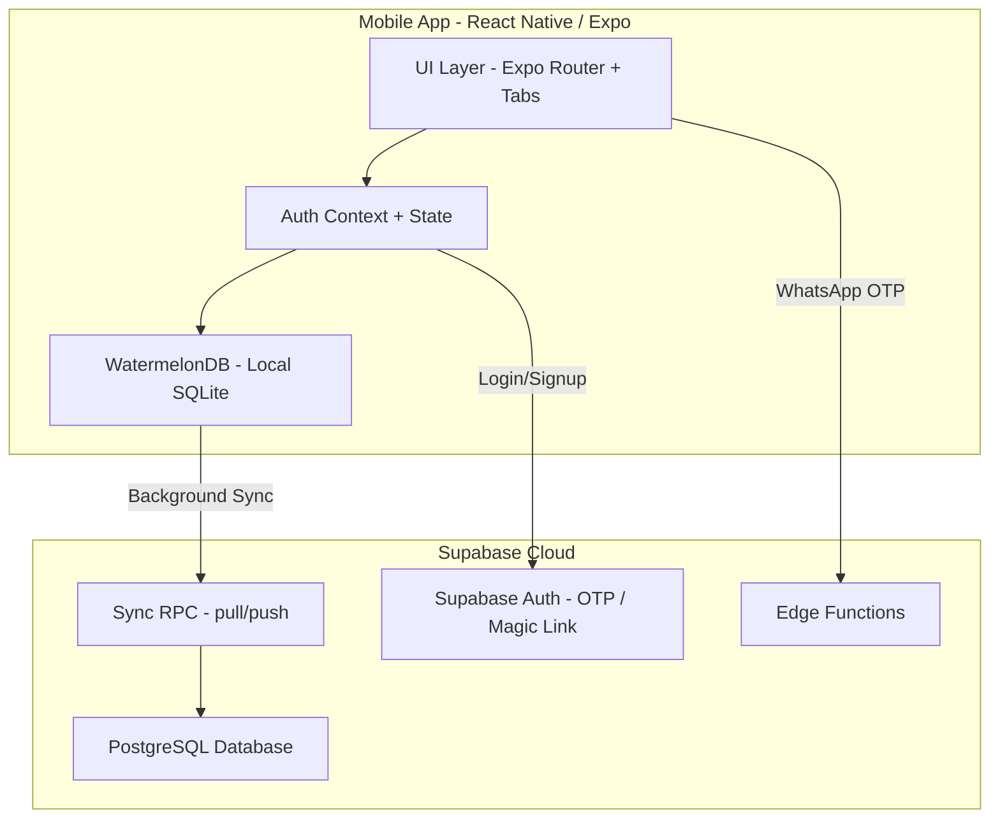
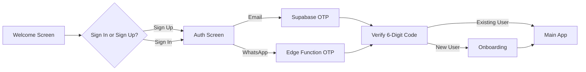
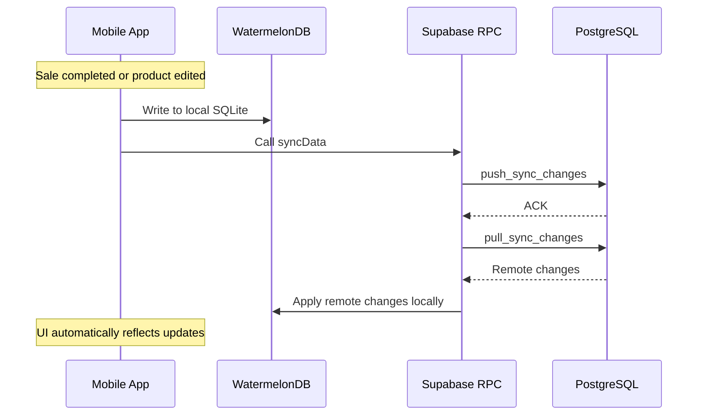

# ShopX — System Documentation

> **ShopX** is an offline-first, mobile Point-of-Sale (POS) and inventory management platform built for African merchants. It empowers solo shop owners, multi-location businesses, and their attendants to sell, track inventory, and gain business insights — even without an internet connection.

---

## Table of Contents

1. [Architecture Overview](#architecture-overview)
2. [Technology Stack](#technology-stack)
3. [Authentication & Onboarding](#authentication--onboarding)
4. [Core Features](#core-features)
5. [Data Models](#data-models)
6. [Screen-by-Screen Breakdown](#screen-by-screen-breakdown)
7. [Synchronization & Cloud Sync](#synchronization--cloud-sync)
8. [Security Model](#security-model)
9. [Roadmap & Future Features](#roadmap--future-features)

---

## Architecture Overview

### Design Principles

| Principle | Implementation |
|---|---|
| **Offline-First** | All data is stored locally in WatermelonDB (SQLite). The app works fully without internet. |
| **Sync-on-Connect** | When connectivity is available, a background sync pushes local changes to Supabase PostgreSQL and pulls remote updates. |
| **Multi-Tenant** | Each store is isolated by `org_id` / `store_id`. A merchant can own multiple stores. |
| **Role-Based Access** | Solo Owners see everything. Attendants see only stores they are authorized for. |

---

## Technology Stack

| Layer | Technology |
|---|---|
| **Framework** | React Native (Expo SDK) |
| **Navigation** | Expo Router (file-based routing) |
| **Local Database** | WatermelonDB (SQLite adapter) |
| **Cloud Backend** | Supabase (Auth, PostgreSQL, Edge Functions) |
| **Styling** | NativeWind (TailwindCSS for React Native) |
| **Animations** | React Native Reanimated |
| **Haptics** | Expo Haptics |
| **Image Handling** | Expo Image Picker |

---

## Authentication & Onboarding

### Login Flow

### Onboarding Collects:

| Field | Required | Notes |
|---|---|---|
| Store Logo | Optional | Uploaded via Image Picker. Displayed throughout the app. |
| Store Name | Yes | e.g. "Ade's Provision Shop" |
| Business Categories | Optional | **Multi-select** from: Retail, Electronics, Grocery, Fashion & Apparel, Health & Beauty, Restaurant & Cafe, Hardware, Services, Other |
| Admin Email | Yes | Used for account recovery and notifications |
| Contact Phone | Optional | Store contact number |

### Developer Bypass (Testing Only)

During development, you can bypass OTP verification by entering `111111` as the 6-digit code. This injects a mock session and routes you directly into the app.

---

## Core Features

### 1. POS Register (Sales)

The Register screen is the cashier's primary workspace. It provides:

- **Full-Screen Product Grid**: All available products displayed as tappable cards in a 2-column grid.
- **Live Quantity Badges**: Blue badges on product cards show how many of each item are in the current cart.
- **Floating Smart Cart**: A sleek, animated button at the bottom appears only when items are added. It shows total item count and total price.
- **Checkout Bottom Sheet**: Sliding up from the floating cart reveals:
  - Line-item breakdown with +/- quantity controls
  - Total Due calculation
  - Payment method selection (Cash, POS Terminal, Direct Transfer)
- **Stock Enforcement**: Cannot add items beyond available stock. Visual warnings for low-stock and sold-out items.
- **Haptic Feedback**: Tactile feedback on add-to-cart, checkout, and payment confirmation.
- **Automatic Sync**: After every sale, inventory is updated locally and a background sync is triggered.

### 2. Inventory Management

The Inventory screen is the stock control center:

- **List View / Grid View Toggle**: Switch between a detailed list view (with images, prices, FX conversions) and a compact grid view for quick scanning.
- **Category Filtering**: Horizontal scrollable category chips at the top. Filter products by their assigned category instantly.
- **Product Cards**: Each product shows:
  - Product image (or placeholder icon)
  - Name and category label
  - Selling price in NGN with USD equivalent
  - Color-coded stock badges (Green = healthy, Amber = low, Red = sold out)
- **Add / Edit Products**: Full-screen modal for creating or editing products with fields for:
  - Product photo upload
  - Product name
  - Selling price and stock quantity (side by side)
  - Category assignment
- **Real-Time Alerts**: Stock changes notify all connected attendants.

### 3. Store Hub

The Store tab serves as the merchant's command center:

- **ShopX Lens**: Camera-based product scanning and recognition
- **Alerts & Notifications**: Real-time alerts for stock changes, anomalies, and operational events
- **Leads Tracker**: Track potential customers and sales leads
- **Staff & Attendants**: Manage team members and their store access permissions
- **Business Settings**: Configure store preferences, currency, and business rules
- **Trending Products**: At-a-glance view of best-performing products

### 4. Settings

The Settings tab provides administrative controls:

- **Activity Log**: Audit trail of all system events
- **Alerts Configuration**: Customize notification preferences
- **Team Management**: Add/remove attendants, set access levels
- **Business Settings**: Store profile, currency configuration

### 5. WhatsApp Integration

- **WhatsApp OTP Login**: Authenticate via WhatsApp message for users who prefer phone-based login
- **WhatsApp Reports**: Send business reports and summaries via WhatsApp
- **Customer Notifications**: Alert customers about order status

---

## Data Models

The local database (WatermelonDB) uses the following schema:

### Products
| Column | Type | Description |
|---|---|---|
| org_id | string | The store this product belongs to |
| name | string | Product display name |
| category | string (optional) | Category label for filtering |
| image_url | string (optional) | Local or remote image URI |
| base_currency | string | Currency code (NGN, USD, GBP) |
| cost_price | number | Wholesale / cost price |
| selling_price | number | Retail price shown to cashier |
| stock_quantity | number | Current stock count |
| created_at | timestamp | Auto-generated |

### Sales Events
| Column | Type | Description |
|---|---|---|
| store_id | string | Which store made the sale |
| ticket_id | string (optional) | Groups items in the same transaction |
| product_id | string (optional) | Reference to the product sold |
| quantity | number | Units sold |
| price_at_sale | number | Price locked at time of sale |
| event_type | string | "sale", "return", "void" |
| attendant_id | string (optional) | Who processed the sale |
| created_at | timestamp | Auto-generated |

### Store Attendants
| Column | Type | Description |
|---|---|---|
| store_id | string | Which store they can access |
| attendant_id | string | User identity |
| access_level | string | Permission tier |
| created_at | timestamp | Auto-generated |

### Other Tables
- **operational_anomalies** — Tracks irregular events (cash drawer discrepancies, unusual voids)
- **cash_drawer_logs** — Shift-based cash drawer open/close with expected vs actual amounts
- **leads** — Customer lead tracking for merchants

---

## Screen-by-Screen Breakdown

| Screen | File | Purpose |
|---|---|---|
| Welcome | `src/app/welcome.tsx` | Animated landing page with Sign In / Sign Up CTAs |
| Auth | `src/app/auth.tsx` | Email or WhatsApp OTP entry and verification |
| Onboarding | `src/app/onboarding.tsx` | Store setup wizard (logo, name, categories, admin info) |
| Register (POS) | `src/app/(tabs)/index.tsx` | Product grid + floating cart + checkout bottom sheet |
| Inventory | `src/app/(tabs)/inventory.tsx` | Category-filtered product list with grid/list toggle |
| Store Hub | `src/app/(tabs)/store/index.tsx` | Command center with feature shortcuts |
| Leads | `src/app/(tabs)/store/leads.tsx` | Customer lead tracking |
| WhatsApp | `src/app/(tabs)/store/whatsapp.tsx` | WhatsApp integration hub |
| Settings | `src/app/(tabs)/settings/index.tsx` | Main settings dashboard |
| Team | `src/app/(tabs)/settings/team.tsx` | Staff and attendant management |
| Alerts | `src/app/(tabs)/settings/alerts.tsx` | Notification configuration |
| Activity | `src/app/(tabs)/settings/activity.tsx` | Audit log viewer |

---

## Synchronization & Cloud Sync

### How It Works

### Key Behaviors

- **Graceful Offline**: If sync fails (no network), the app continues working. Changes queue locally.
- **Conflict Resolution**: WatermelonDB handles merge conflicts using last-write-wins strategy.
- **Automatic Triggers**: Sync fires after every sale completion and can be manually triggered.

---

## Security Model

| Feature | Implementation |
|---|---|
| **Authentication** | Supabase Auth with OTP (Email) or Edge Function (WhatsApp) |
| **Device Guard** | Device-level security checks via `deviceGuard.ts` |
| **Session Management** | JWT-based sessions managed by Supabase SDK |
| **Role Isolation** | Solo owners have full access; attendants are scoped to assigned stores |
| **Data Encryption** | SQLite data at rest, HTTPS for all cloud communication |

---

## Roadmap & Future Features

| Feature | Status | Description |
|---|---|---|
| Barcode / QR Scanning | Planned | Scan products directly into POS or Inventory |
| Receipt Generation | Planned | Generate and share PDF/image receipts |
| Multi-Currency POS | Planned | Accept payments in USD, GBP, NGN natively |
| Analytics Dashboard | Planned | Revenue charts, top sellers, peak hours |
| Expense Tracking | Planned | Log business expenses alongside revenue |
| Customer Loyalty | Planned | Points system and repeat-customer tracking |
| Supplier Management | Planned | Track suppliers, reorder points, purchase orders |
| Deep Linking (Auth) | Planned | Handle Supabase magic links natively in-app |

---

> **ShopX** — Built for African merchants. Sell anywhere. Sync everywhere.
